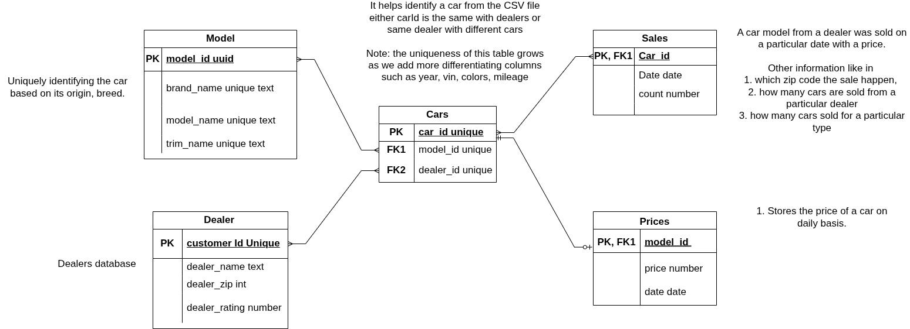
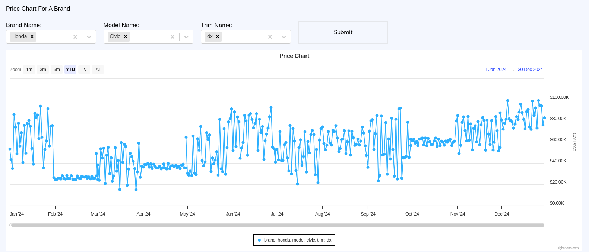
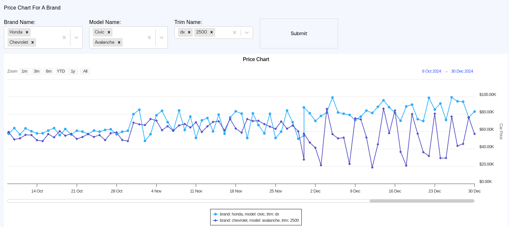
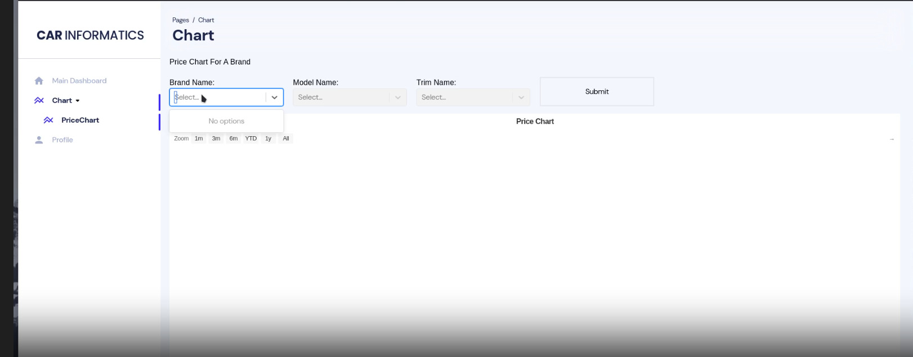

## 🚀 Car Price Fluctuation Dashboard

**Full-Stack Web App:** React / Highcharts frontend + Python backend

### 🔍 Project Overview
Built an interactive dashboard that visualizes how car prices for a given **brand**, **model**, and **trim** have varied over time—across multiple U.S. cities. Users can select one or more brands, models, trims (and cities, if you choose to expose that filter) and immediately see dynamic, zoomable time-series charts illustrating historical price trends.

### ⚙️ Features
- **Multi-Select Filters** for Brand, Model & Trim (and City)  
- **Highcharts** time-series plot with  
  - Range selector (1 m, 3 m, 6 m, YTD, 1 y, All)  
  - Zoom & pan controls  
  - Multi-series comparison (e.g. Honda Civic dx vs. Chevrolet Avalanche 2500)  
- **Responsive Layout**: adapts to desktop & mobile  
- **Asynchronous Data Loading**:  
  - “Submit” button fetches fresh JSON from backend  
  - Loading spinner & error handling  

### 🏗️ Architecture & Data Flow
1. **React Frontend**  
   - Uses controlled `<Select>` components (Ant-Design / Material-UI / React-Select) for filters  
   - On submit, calls a REST endpoint (`/api/prices?brand=…&model=…&trim=…&city=…`)  
2. **Python Backend** (Flask / FirebaseSDK)  
   - Parses query parameters, queries a Pandas-backed store or SQL database  
   - Returns JSON array: `[{ date: '2024-01-02', price: 45000 }, …]` per series  
3. **Highcharts**  
   - Renders each JSON series with markers & lines  
   - Auto-formats Y-axis as “$XX.XK”  
4. **Data Storage**  
   - Parquet files to Firebase:  
     ```text
     brand, model, trim, city, date, price
     ```
   - Python uses Pandas (or SQLAlchemy) to filter and group by time  

### 🛠️ Tech Stack
| Layer        | Technologies                                 |
| ------------ | -------------------------------------------- |
| Frontend     | React, Highcharts, React-Select (or MUI)     |
| Backend      | Python, Flask / FastAPI, Pandas, SQLAlchemy   |
| Database     | PostgreSQL (or CSV / Pandas)                  |
| Deployment   | Docker, GitHub Actions (CI / CD), AWS (optional)  |

## 📊 Screenshots & Demo
### ***Database Schema***
<p align="center">
  
</p>

### ***Single Line Graph of Single Car***:
<p align="center">
  
</p>

> Selecting Brand, Model and Trim

### ***Multi Line Graph of Multiple Cars***:
<p align="center">
  
</p>

### ***Watch Below Demo Video for App Real-time Functionality***
[](./results/demo/webdemo.mp4)

## 🚀 How to Run Locally
### Instructions:

### Front-End:

1. Install node version - v20.17.0 & npm - v10.8.2 (recommended to install via nvm)
2. Install yarn globally - v1.22.22 (`npm install -g yarn`)
3. Go to Project root directory (.../project-1)
4. run: `yarn install` ---> this will install dependencies
5. run: `yarn start` ---> this will start react server
6. In Browser, open `http://localhost:3000/`

### Back-End

1. Recommended to create a `python virtual environment` for the setup
2. Install the packages mentioned in the `upload.ipynb` notebook, first cell.
